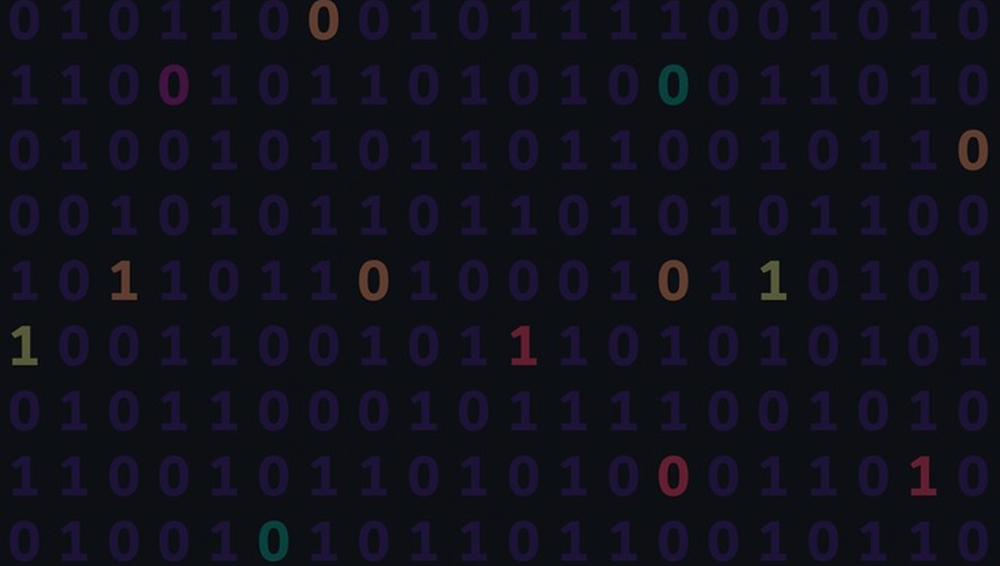

# Hola / Hi ,

>[es] mi nombre es Vanessa Berazategui y soy Ingeniera en Computación de la Facultad de Ingeniería 
>de la Universidad de la República.  Actualmente me encuentro trabajando como Team Lead de proyectos 
>desarrollados con Flutter en una empresa del sector privado en Montevideo, Uruguay. Me caracterizo por 
>ser una persona proactiva, organizada y perseverante, fanática de la tecnología, la programación y con 
>un fuerte interés en las áreas del internet de las cosas, la interacción persona-computadora, la domótica 
>y las tecnologías usables.
>
>
>[en] my name is Vanessa Berazategui and I'm a Computer Engineer from the School of Engineering of the University 
>of the Republic. I am currently working as a Team Lead on projects developed with Flutter in a private sector 
>company in Montevideo, Uruguay. I am characterized as being a proactive, organized, and persevering person, a fan 
>of technology, and programming, and with a strong interest in the areas of the internet of things, human-computer 
>interaction, home automation, and wearable technologies. 

  

 👉🏼 Encuentrame en / Find me on

 

